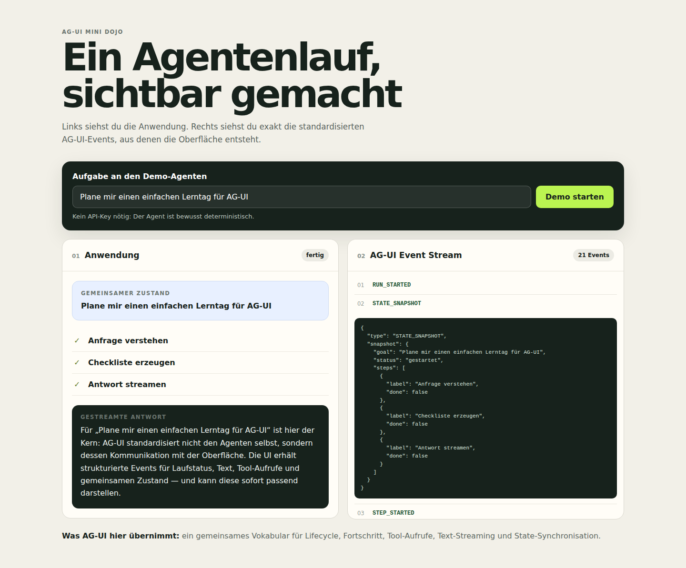

# AG-UI Mini Dojo

Eine bewusst kleine, vollständige AG-UI-Anwendung zum Lernen. Sie zeigt **dieselbe Interaktion zweimal**:

1. links als normale Benutzeroberfläche;
2. rechts als rohe AG-UI-Events, aus denen diese Oberfläche entsteht.

Die Demo braucht **keinen LLM-API-Key**. Der Agent ist deterministisch, damit du dich auf das Protokoll konzentrieren kannst.



## Schnellstart

Voraussetzung: Node.js 20 oder neuer.

```bash
npm install
npm run dev
```

Dann [http://localhost:5173](http://localhost:5173) öffnen und **Demo starten** drücken.

Produktionsmodus:

```bash
npm run build
npm start
```

Dann läuft die Anwendung auf [http://localhost:8765](http://localhost:8765). Mit `PORT=9000 npm start` kannst du den Port ändern.

## Was ist AG-UI?

AG-UI (*Agent–User Interaction Protocol*) ist ein offenes, ereignisbasiertes Protokoll zwischen einem Agenten und einer Benutzeroberfläche.

Es schreibt **nicht** vor:

- welches LLM du verwendest;
- ob dein Agent mit LangGraph, Mastra, Pydantic AI oder eigener Logik gebaut ist;
- wie deine Oberfläche aussehen muss.

Es standardisiert stattdessen die Kommunikation. Ein Frontend kann dadurch beispielsweise verstehen:

- wann ein Agentenlauf beginnt und endet;
- welcher Arbeitsschritt gerade läuft;
- welche Textteile gerade gestreamt werden;
- welches Tool der Agent aufruft;
- wie sich gemeinsamer Anwendungszustand verändert.

## Was passiert in dieser Anwendung?

```text
React-Oberfläche
    │
    │  POST /agent mit RunAgentInput
    ▼
@ag-ui/client: HttpAgent
    │
    │  HTTP + Server-Sent Events
    ▼
Express-Demo-Agent
    │
    ├─ RUN_STARTED
    ├─ STATE_SNAPSHOT
    ├─ STEP_STARTED / STEP_FINISHED
    ├─ TOOL_CALL_START / ARGS / END / RESULT
    ├─ TEXT_MESSAGE_START / CONTENT / END
    ├─ STATE_DELTA (JSON Patch)
    └─ RUN_FINISHED
```

### 1. Der Client

In [`client/src/main.tsx`](client/src/main.tsx) wird ein offizieller `HttpAgent` aus `@ag-ui/client` erzeugt:

```ts
const agent = new HttpAgent({
  url: "/agent",
  agentId: "mini-dojo-agent",
  threadId: "learning-thread",
});
```

Der Client sendet die Benutzernachricht und reagiert auf standardisierte Events:

- `onEvent` füllt den sichtbaren Event-Log;
- `onTextMessageContentEvent` zeigt gestreamten Text;
- `onStateChanged` aktualisiert Status und Checkliste.

Das Frontend muss daher keine proprietären Serverantworten erraten.

### 2. Der Agenten-Server

[`server/index.ts`](server/index.ts) nimmt `RunAgentInput` entgegen, validiert ihn mit `RunAgentInputSchema` aus `@ag-ui/core` und sendet typisierte Events zurück.

`EventEncoder` aus `@ag-ui/encoder` serialisiert jedes Event als Server-Sent Event:

```text
data: {"type":"TEXT_MESSAGE_CONTENT", ...}
```

Der Agent ist hier absichtlich nur ein kleiner Async-Generator. Du kannst `buildDemoEvents()` später durch einen echten Agenten ersetzen, ohne das Frontend-Protokoll neu zu erfinden.

### 3. Gemeinsamer Zustand

Zuerst sendet der Server einen vollständigen Zustand:

```ts
{
  type: EventType.STATE_SNAPSHOT,
  snapshot: { goal, status: "gestartet", steps: [...] }
}
```

Danach sendet er nur Änderungen als JSON Patch:

```ts
{
  type: EventType.STATE_DELTA,
  delta: [{ op: "replace", path: "/steps/0/done", value: true }]
}
```

Der AG-UI-Client setzt daraus automatisch den aktuellen Zustand zusammen.

## Wobei hilft dir AG-UI konkret?

AG-UI ist besonders nützlich, wenn dein Agent mehr als eine fertige Chatantwort liefert:

- **Streaming:** Text und Fortschritt werden sofort sichtbar.
- **Transparenz:** Tool-Aufrufe und Arbeitsschritte lassen sich darstellen.
- **Generative UI:** Tool-Ergebnisse können als Karten, Tabellen oder Formulare gerendert werden.
- **Shared State:** Agent und UI arbeiten auf einem synchronisierten Zustand.
- **Human in the Loop:** Ein Lauf kann für Freigaben oder Rückfragen unterbrochen werden.
- **Austauschbarkeit:** Agenten-Framework und Client sind weniger eng gekoppelt.

Für einen simplen Chat, der nur eine Textantwort zurückgibt, ist AG-UI möglicherweise mehr Infrastruktur als nötig. Sein Vorteil wird sichtbar, sobald ein Agent **länger arbeitet, Tools verwendet oder die Oberfläche aktiv mitsteuert**.

## Projektstruktur

```text
ag-ui-mini-dojo/
├── client/
│   ├── index.html
│   └── src/
│       ├── main.tsx       # HttpAgent, Subscriber und UI
│       └── styles.css
├── server/
│   ├── index.ts           # AG-UI-Endpunkt und Demo-Agent
│   └── index.test.ts      # Protokoll-/Event-Test
├── e2e/
│   └── demo.mjs           # echter Browser-Flow mit Playwright
├── artifacts/
│   └── ag-ui-mini-dojo.png
└── package.json
```

## Tests

```bash
npm run typecheck
npm test
npm run build
```

Browser-Test gegen den laufenden Produktionsserver:

```bash
npm start
# in einem zweiten Terminal
npm run test:e2e
```

Der E2E-Test prüft, dass:

- der Lauf sichtbar abgeschlossen wird;
- mindestens 15 AG-UI-Events ankommen;
- ein Tool-Result sichtbar ist;
- die vollständige gestreamte Antwort gerendert wird;
- alle State-Schritte abgeschlossen sind;
- der Event-Log korrekt bei `01` beginnt.

## Zwei sinnvolle Einstiege: dieses Repo oder CopilotKit

Es gibt zwei unterschiedliche „einfachste“ Wege – abhängig davon, was du lernen möchtest:

| Ziel | Passender Einstieg |
|---|---|
| Das AG-UI-Protokoll, SSE und einzelne Events wirklich verstehen | **Dieses Mini-Dojo** mit `@ag-ui/client`, `@ag-ui/core` und `@ag-ui/encoder` |
| Möglichst schnell eine produktnahe Agenten-App mit fertigem Chat bauen | **CopilotKit/Next.js** mit `@copilotkit/react-core` und `@copilotkit/runtime` |

CopilotKit kapselt AG-UI und bringt fertige React-Komponenten, Runtime und APIs wie `useFrontendTool` mit. Das spart Code, verbirgt aber einen Teil des Protokollflusses, den dieses Repo bewusst sichtbar macht. Ein sinnvoller Lernpfad ist daher:

1. dieses Repo starten und Eventfluss nachvollziehen;
2. im offiziellen Dojo die Features vergleichen;
3. anschließend eine CopilotKit-Anwendung scaffolden und einen echten Agenten anbinden.

Der offizielle Scaffold dafür ist:

```bash
npx create-ag-ui-app@latest
```

Dort kannst du **CopilotKit/Next.js** wählen. Für einen echten Built-in Agent wird anschließend ein Modellprovider beziehungsweise API-Key benötigt.

## Vom Mini-Dojo zum offiziellen Dojo

Der offizielle [AG-UI Dojo](https://dojo.ag-ui.com/) zeigt dieselben Konzepte für viele Agenten-Frameworks und zusätzliche Fähigkeiten. Dieses Repository ist absichtlich kleiner, damit der komplette Datenfluss in wenigen Dateien nachvollziehbar bleibt.

Sinnvolle nächste Beispiele im offiziellen Dojo:

1. **Agentic Chat** – einfachster Einstieg;
2. **Backend Tool Rendering** – Tool-Aufrufe sichtbar machen;
3. **Shared State** – bidirektionale Zustandssynchronisation;
4. **Human in the Loop** – Freigaben und Unterbrechungen;
5. **Generative UI** – agentspezifische UI-Komponenten.

## Offizielle Quellen

- [AG-UI Dojo](https://dojo.ag-ui.com/)
- [AG-UI Repository](https://github.com/ag-ui-protocol/ag-ui)
- [Anwendungen bauen](https://docs.ag-ui.com/quickstart/applications)
- [`HttpAgent`](https://docs.ag-ui.com/sdk/js/client/http-agent)
- [Event-Typen und Eventfluss](https://docs.ag-ui.com/concepts/events)

## Nächster sinnvoller Umbau

Wenn du daraus eine echte KI-Anwendung machen möchtest, ersetze nur `buildDemoEvents()` durch einen Framework-Adapter oder LLM-Aufruf. Behalte den `HttpAgent`, den `/agent`-Endpunkt und die sichtbare Event-Anzeige zunächst bei — sie machen Debugging und Lernen deutlich leichter.
